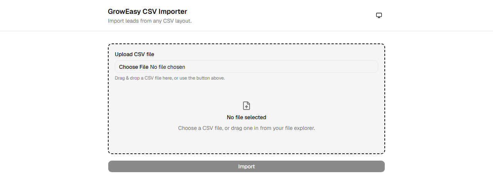
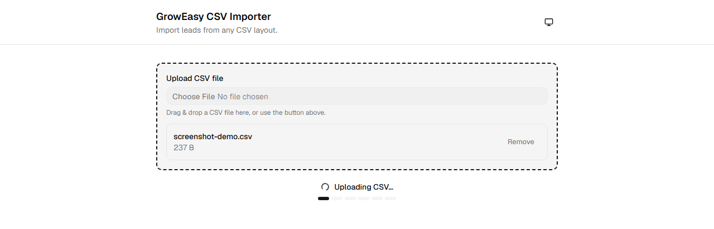
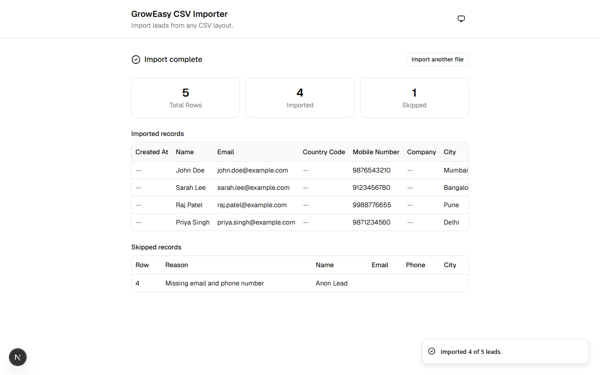
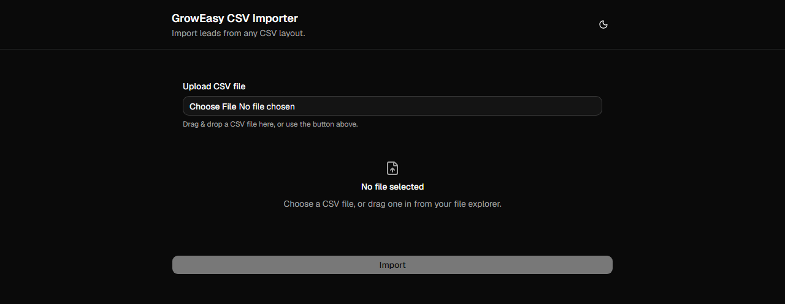

# GrowEasy AI-Powered CSV Importer

An AI-powered CSV importer that takes a lead-export CSV in **any layout** — Facebook Lead
Ads, Google Ads, a real-estate CRM export, a manually created spreadsheet — and
intelligently maps its columns onto a fixed 15-field GrowEasy CRM schema using an LLM,
with drag-and-drop upload, a live progress indicator, virtualized results tables, and
dark mode.

No database, no auth, no job queue — everything happens in one stateless
upload → parse → validate → AI-extract → respond request/response cycle.

---

## Screenshots

| Upload (drag & drop)                                                        | Import in progress                                                                       |
| :-------------------------------------------------------------------------- | :--------------------------------------------------------------------------------------- |
|  |  |

| Results                                                                             | Dark mode                                                                |
| :---------------------------------------------------------------------------------- | :----------------------------------------------------------------------- |
|  |  |

---

## Features

- **Layout-agnostic CSV import** — column names never need to match the CRM schema; an
  LLM infers the mapping row-by-row, batch-by-batch.
- **Drag & drop or click-to-browse** upload, with inline validation and a visual
  drop-target state.
- **Honest progress indicator** — a real, ordered pipeline sequence (uploading → parsing
  → validating → preparing batches → AI processing), never a fabricated percentage.
- **Batched, concurrent, retried AI extraction** — rows are chunked into batches, sent to
  Gemini with bounded concurrency, and retried with jittered exponential backoff on
  transient failures (rate limits, timeouts, 5xx), so one bad batch never fails the whole
  import.
- **Defense-in-depth validation** — every AI-returned record is re-validated against the
  shared CRM schema and the skip rule is re-applied in code, regardless of what the
  prompt asked for.
- **Virtualized results tables** ([`@tanstack/react-virtual`](https://tanstack.com/virtual)) —
  a 10,000-row result renders only the visible rows in the DOM; small results render
  identically to before virtualization existed.
- **Dark mode** — system-aware, persisted, no flash on load.
- **Graceful degradation everywhere** — partial AI failures still return a usable result
  (imported rows + a clear note about what failed); total failure returns a clean,
  actionable error, never a stack trace.

---

## Architecture Overview

```
┌──────────────────────────┐         ┌───────────────────────────┐
│   apps/web (Next.js)     │  HTTPS  │   apps/api (Express)       │
│                           │ ──────► │                             │
│  Drag & drop / click      │         │  Route → thin controller    │
│  → POST the raw file      │         │  → ImportService             │
│  → progress indicator     │         │     → CSV parse + validate   │
│  → results (virtualized)  │ ◄────── │     → batch + AI extraction  │
└──────────────────────────┘  JSON   │     → post-AI validation      │
                                       │        (GeminiProvider)       │
                                       └───────────────────────────┘
                 ▲                                    ▲
                 │                                    │
                 └──────────── packages/shared ───────┘
                    (zod schemas, types, constants,
                          CSV parsing utils)
```

- **`apps/web`** — a single Client Component (`ImportWorkflow`) owns the whole
  select → upload → results lifecycle via one `useState` (file) and one `useReducer`
  (request lifecycle: idle/loading/success/error). No global state library — nothing in
  this flow needs to outlive the component tree.
- **`apps/api`** — layered `routes → controllers → services → providers`, with
  dependency inversion used at exactly one seam: the AI provider
  (`AiProvider` interface, `GeminiProvider` the only implementation today). Everything
  else is concrete — no interfaces for things with one implementation and no second one
  in sight.
- **`packages/shared`** — the single source of truth for anything both apps must agree
  on: the CRM field list, zod schemas (with types derived via `z.infer`, never
  hand-duplicated), CSV parsing, and shared constants. Both apps' `tsconfig.json` extend
  one root `tsconfig.base.json`; both build against the same strict TypeScript settings.
- **No database.** Nothing in the product needs data to outlive a single request — no
  import history, no accounts, no resumable jobs. See
  [`docs/03-system-architecture.md`](./docs/03-system-architecture.md) §5–6 for the full
  reasoning (and the list of "enterprise" patterns — job queues, ORMs, DI containers,
  Redux — deliberately rejected as unearned complexity for this project's actual scope).

The full architectural reasoning, including every "why not X" decision, lives in
[`docs/`](./docs) — start with
[`docs/01-assignment-analysis.md`](./docs/01-assignment-analysis.md) for the problem
framing and [`docs/09-coding-guidelines.md`](./docs/09-coding-guidelines.md) for the
enforceable engineering rules.

---

## Folder Structure

```
groweasy-csv-importer/
├── apps/
│   ├── web/                        # Next.js frontend (App Router)
│   │   ├── src/app/                 # layout.tsx, page.tsx, globals.css
│   │   ├── src/components/
│   │   │   ├── ui/                   # shadcn/ui primitives (button, input, table, sonner)
│   │   │   ├── upload/                # CsvFileInput (drag & drop + click)
│   │   │   ├── results/               # summary cards, imported/skipped tables
│   │   │   └── layout/                # header, theme toggle
│   │   ├── src/hooks/                # progress-phase timer, row virtualizer
│   │   ├── src/lib/                  # api-client.ts (typed fetch wrapper), cn()
│   │   └── Dockerfile
│   └── api/                         # Express backend
│       ├── src/routes/               # HTTP verbs + paths only
│       ├── src/services/             # ImportService, AiExtractionService, ...
│       ├── src/ai/                   # GeminiProvider, prompt builder
│       ├── src/middleware/           # upload, CORS/security headers, error handler, logging
│       ├── src/errors/               # AppError hierarchy
│       ├── src/config/               # zod-validated env.ts
│       └── Dockerfile
├── packages/
│   └── shared/                      # types, zod schemas, constants, CSV utils
│       └── src/{schemas,types,constants,utils}/
├── docs/                             # architecture & design docs (read before structural changes)
├── docker-compose.yml                # local multi-container dev/verification
└── .env.example
```

`components/ui/` holds only generated shadcn/ui primitives; everything app-specific lives
in a feature folder next to it. See
[`docs/04-folder-structure.md`](./docs/04-folder-structure.md) for the full rationale.

---

## Tech Stack

| Layer      | Technology                                                                                             |
| ---------- | ------------------------------------------------------------------------------------------------------ |
| Frontend   | Next.js (App Router), TypeScript, Tailwind CSS v4, shadcn/ui, `@tanstack/react-virtual`, `next-themes` |
| Backend    | Node.js, Express, TypeScript, Multer (memory storage), Pino (structured logging)                       |
| Shared     | Internal `@groweasy/shared` npm workspace — zod schemas, types, constants, CSV utilities               |
| AI         | Google Gemini (`@google/genai`), behind a provider-agnostic `AiProvider` interface                     |
| Validation | zod v4 everywhere an external boundary is crossed (HTTP body, file metadata, AI output, env vars)      |
| Database   | None — stateless by design                                                                             |
| Tooling    | npm workspaces monorepo, ESLint (flat config, `no-explicit-any` as an error), Prettier                 |

---

## How AI Extraction Works

1. **The CSV is never sent to the AI whole.** Rows are chunked into batches (`AI_BATCH_SIZE`,
   default 25) — small enough to stay well within context limits with room for few-shot
   examples, large enough to keep the number of round trips reasonable.
2. **Batches run concurrently, not sequentially or all at once.** Up to
   `AI_BATCH_CONCURRENCY` (default 3) batches are in flight at a time, via a small
   dependency-free concurrency-limited pool — bounded specifically to respect the AI
   provider's own rate limits.
3. **Gemini's structured output feature is used, not "ask nicely and hope."** Each batch
   call passes a JSON schema built from the same shared CRM field constants the prompt
   text uses, so the model can only emit tokens that already form a matching JSON shape —
   eliminating "the model wrapped its answer in markdown" as a failure mode entirely.
4. **The prompt encodes real field-mapping heuristics**, not just the target schema:
   semantic header matching (`Ph.`/`Mobile`/`WhatsApp` → phone), splitting combined
   values (`"John Doe <john@x.com>"`), the first-email/first-mobile-wins rule with the
   rest appended to `crm_note`, and an explicit instruction to leave a field blank rather
   than invent a value. Full prompt design: [`docs/07-ai-design.md`](./docs/07-ai-design.md).
5. **Nothing the AI returns is trusted blindly.** Every returned record is re-validated
   against the shared `crmRecordSchema` (zod), the skip rule (no email **and** no mobile →
   skip) is re-applied in code regardless of what the model did, `crm_status`/`data_source`
   are checked against the real enum lists (coerced to `""` if invalid, never rejecting an
   otherwise-good lead over one bad field), and free-text fields are re-sanitized so a raw
   newline from the model can never break the CSV-row invariant.
6. **A batch can fail without failing the import.** On a retryable failure (429 rate
   limit, 5xx, timeout), the batch retries with exponential backoff + jitter, honoring a
   Gemini-suggested retry delay when one is present, capped so a single HTTP request
   can't hang indefinitely. If a batch still fails after retries, its rows are reported
   in `skipped` with reason `AI_EXTRACTION_FAILED` and the rest of the import proceeds —
   only if **every** batch fails does the request return an error.

---

## Installation

Requires **Node.js 20+** and **npm 10+**.

```bash
git clone <repository-url>
cd groweasy-csv-importer
npm install
cp .env.example .env
```

Then fill in `.env` — at minimum, `GEMINI_API_KEY` (get one at
[Google AI Studio](https://aistudio.google.com/apikey)). Every other variable has a
working local-dev default.

---

## Environment Variables

All variables are documented with defaults in [`.env.example`](./.env.example) at the
repo root. `apps/api` reads its variables from that root `.env` file (validated at
startup by a zod schema in `apps/api/src/config/env.ts` — a misconfigured deploy fails
loudly at boot, not mysteriously on the first request); `apps/web` reads
`NEXT_PUBLIC_API_URL` at build time.

| Variable                 | Used by    | Required              | Default                            | Notes                                                                                                                                 |
| ------------------------ | ---------- | --------------------- | ---------------------------------- | ------------------------------------------------------------------------------------------------------------------------------------- |
| `PORT`                   | `apps/api` | no                    | `4000`                             | Railway/Render inject their own value in production.                                                                                  |
| `NODE_ENV`               | `apps/api` | no                    | `development`                      | `development` \| `production` \| `test`.                                                                                              |
| `LOG_LEVEL`              | `apps/api` | no                    | `debug` (dev) / `info` (prod)      | Pino log level.                                                                                                                       |
| `GEMINI_API_KEY`         | `apps/api` | **yes**               | —                                  | Secret. Never commit a real value.                                                                                                    |
| `AI_BATCH_MAX_RETRIES`   | `apps/api` | no                    | `2`                                | Max retries per AI batch call on a retryable failure.                                                                                 |
| `AI_BATCH_CONCURRENCY`   | `apps/api` | no                    | `3`                                | Max batches calling the AI provider at once. Lower this if hitting rate limits.                                                       |
| `AI_REQUEST_TIMEOUT_MS`  | `apps/api` | no                    | `60000`                            | Per-request timeout to Gemini.                                                                                                        |
| `AI_RETRY_BASE_DELAY_MS` | `apps/api` | no                    | `500`                              | Retry backoff base (exponential + jitter).                                                                                            |
| `AI_RETRY_MAX_DELAY_MS`  | `apps/api` | no                    | `8000`                             | Retry backoff cap.                                                                                                                    |
| `ALLOWED_ORIGIN`         | `apps/api` | **yes in production** | `http://localhost:3000` (dev only) | Comma-separated exact origin(s) for CORS. The server refuses to boot in production without this set — see §4 below. Never a wildcard. |
| `NEXT_PUBLIC_API_URL`    | `apps/web` | **yes**               | —                                  | Base URL of the backend API. Baked into the client bundle at build time.                                                              |

No secrets are committed anywhere in this repo — `.env` is gitignored, and
`.env.example` contains only placeholders/safe defaults.

---

## Running Locally

```bash
npm run dev
```

Runs `packages/shared` in watch mode alongside the Next.js dev server (`apps/web`,
`http://localhost:3000`) and the Express dev server (`apps/api`, `http://localhost:4000`)
concurrently.

```bash
npm run build        # builds packages/shared, then apps/api, then apps/web
npm run typecheck    # strict typecheck across every workspace
npm run lint         # ESLint across every workspace
npm run format        # Prettier — write
npm run format:check  # Prettier — check only
```

Each workspace also exposes its own scripts (`npm run dev -w apps/api`, etc.) if you
need to run just one piece.

### Running with Docker

```bash
cp .env.example .env   # fill in GEMINI_API_KEY
docker compose up --build
```

Brings up both services with health checks (`apps/web` on `:3000`, `apps/api` on
`:4000`). See [Docker](#docker) below for what each image actually does.

---

## Production Build

```bash
npm run build
```

Builds `packages/shared` first (both apps depend on its compiled output), then
`apps/api` (`tsc` → `apps/api/dist`), then `apps/web` (`next build`, with
`output: "standalone"` enabled — see [Docker](#docker)).

To run the production build locally without Docker:

```bash
node apps/api/dist/index.js          # backend, reads PORT/GEMINI_API_KEY/... from env
npm run start -w apps/web             # frontend, next start
```

---

## Running Tests

No automated test suite exists yet. This was an explicit scope decision, not an
oversight — see [Known Limitations](#known-limitations). `npm test` is intentionally
not wired up at the root; adding a test runner is a natural next step, not something
retrofitted late for the sake of a checklist.

---

## Deployment

**Frontend → Vercel.** Native Next.js support, zero-config. Set the project's root
directory to `apps/web`; Vercel's npm workspace support handles the monorepo install.
Set `NEXT_PUBLIC_API_URL` to the deployed backend's URL in the Vercel project's
environment variables (Production **and** Preview, if you use preview deployments).

**Backend → Railway or Render** (not Vercel serverless functions). A long-lived Node
process has no per-request timeout ceiling — important because multi-batch AI
extraction on a larger CSV can legitimately run longer than a serverless function's
timeout budget. Point the platform at `apps/api/Dockerfile` (both platforms build
directly from a Dockerfile), or use their native Node buildpack with build command
`npm run build -w packages/shared && npm run build -w apps/api` and start command
`node apps/api/dist/index.js`. Set every `apps/api` variable from the
[Environment Variables](#environment-variables) table above in the platform's
dashboard — **`ALLOWED_ORIGIN` must be set to the exact deployed Vercel URL**
(`https://...`, no trailing slash) or the API refuses to boot.

**No hardcoded localhost.** Every URL that differs between environments
(`NEXT_PUBLIC_API_URL`, `ALLOWED_ORIGIN`) is environment-variable-driven; nothing in
application code assumes `localhost`.

Pre-submission checklist:

- [ ] Frontend hosted URL completes a full upload → import → results cycle against the
      **real, deployed** backend (not local).
- [ ] Backend `GET /api/health` reachable directly at its public URL.
- [ ] `GEMINI_API_KEY` set on the host's dashboard, never in a committed file.
- [ ] `ALLOWED_ORIGIN` matches the deployed frontend's exact origin.
- [ ] `NEXT_PUBLIC_API_URL` matches the deployed backend's exact origin.

---

## Docker

Production Dockerfiles exist for both apps (`apps/api/Dockerfile`,
`apps/web/Dockerfile`), plus a root `docker-compose.yml` for local multi-container
verification. Both platforms in the [Deployment](#deployment) section above support
building directly from a Dockerfile as an alternative to their native buildpacks — this
is additive, not a change to the deployment targets.

Both Dockerfiles are multi-stage, built from the **repo root** as build context (since
each app depends on `packages/shared` as an npm workspace member):

```bash
docker build -f apps/api/Dockerfile -t groweasy-api .
docker build -f apps/web/Dockerfile -t groweasy-web \
  --build-arg NEXT_PUBLIC_API_URL=https://your-backend-url .
```

- **`apps/api/Dockerfile`**: `deps` (full install) → `build` (compiles `packages/shared`
  then `apps/api`) → `prod-deps` (a second, `--omit=dev` install for a slim runtime
  `node_modules`) → `runtime` (only compiled `dist/` output + production dependencies,
  non-root user, `HEALTHCHECK` against the real `GET /api/health` route using Node's
  built-in `http` module — no `curl` needed in the image).
- **`apps/web/Dockerfile`**: same `deps`/`build` shape, but the runtime stage uses
  Next.js's `output: "standalone"` trace (only the `node_modules` subset the app
  actually needs, computed by Next itself) plus `.next/static` and `public/` copied in
  separately (not part of the trace) — non-root user, dependency-free `HEALTHCHECK`
  against the homepage.

> **Note on verification**: both Dockerfiles were built, run, and exercised end-to-end
> against a real Docker daemon, including through `docker compose up` together. Two real
> bugs were caught and fixed this way — neither was visible from reading the Dockerfiles
> alone: (1) a missing `tsconfig.base.json` copy (every workspace's `tsconfig.json`
> extends it); (2) `**/*.tsbuildinfo` was missing from `.dockerignore` (only the
> non-recursive `*.tsbuildinfo` was present), so a stale local incremental-build cache
> file leaked into the build context and silently convinced `tsc -b` the shared package
> was already built, producing an empty `dist/`. Separately, the frontend container was
> confirmed reachable externally but failing its own internal healthcheck — Docker
> injects a `HOSTNAME` env var set to the container ID, and Next's standalone server
> binds to that literal value instead of all interfaces unless overridden, so the
> container could serve traffic via its Docker-assigned IP but never answered on
> `127.0.0.1` from inside itself; fixed with an explicit `ENV HOSTNAME=0.0.0.0`. After
> both fixes: `docker build` succeeds for both images, both containers report
> `healthy`, `docker compose up` correctly sequences the frontend to wait for the
> backend's health check, and a real CORS preflight against the running containers
> succeeds.

---

## API Documentation

Base path: `/api`. JSON in, JSON out, except the import endpoint (`multipart/form-data`
in, JSON out). All success responses: `{ "data": ... }`. All error responses:
`{ "error": { "code": ..., "message": ... } }`.

### `POST /api/imports`

The one functional endpoint. Accepts a CSV file, parses it, runs AI extraction, returns
CRM records.

**Request** — `multipart/form-data`, field `file` (binary, required).

Constraints (values from `packages/shared/src/constants/limits.ts`):

- Must be `.csv` by extension **and** an accepted MIME type (`text/csv`,
  `application/vnd.ms-excel`, etc. — some browsers/OSes mislabel CSVs).
- Max size: 5 MB.
- Max rows: 10,000 — rejected early with a clear error rather than accepted and timed out.

**Response `200`**

```jsonc
{
  "data": {
    "imported": [
      {
        "created_at": "2026-05-13 14:20:48",
        "name": "John Doe",
        "email": "john.doe@example.com",
        "country_code": "+91",
        "mobile_without_country_code": "9876543210",
        "company": "GrowEasy",
        "city": "Mumbai",
        "state": "Maharashtra",
        "country": "India",
        "lead_owner": "test@gmail.com",
        "crm_status": "GOOD_LEAD_FOLLOW_UP",
        "crm_note": "Client is asking to reschedule demo",
        "data_source": "",
        "possession_time": "",
        "description": "",
      },
    ],
    "skipped": [
      {
        "row": 7,
        "reason": "MISSING_CONTACT_INFO",
        "raw": { "Name": "Anon Lead", "Notes": "called, no number given" },
      },
    ],
    "summary": {
      "totalRows": 42,
      "totalImported": 40,
      "totalSkipped": 2,
      "batches": { "total": 2, "failed": 0 },
    },
  },
}
```

`crm_status` ∈ `GOOD_LEAD_FOLLOW_UP | DID_NOT_CONNECT | BAD_LEAD | SALE_DONE | ""`.
`data_source` ∈ `leads_on_demand | meridian_tower | eden_park | varah_swamy | sarjapur_plots | ""`.
`skipped[].reason` ∈ `MISSING_CONTACT_INFO | AI_EXTRACTION_FAILED`.

A **partial** AI failure (some batches succeed, some don't) is still a `200` —
`summary.batches.failed` and the per-row skip reasons communicate it; the HTTP call only
fails if **every** batch fails.

### `GET /api/health`

Liveness check. No auth, no business logic.

```jsonc
{ "data": { "status": "ok", "uptime": 1234.5 } }
```

### Error codes

| Code                       | HTTP status | Meaning                                                                 |
| -------------------------- | ----------- | ----------------------------------------------------------------------- |
| `VALIDATION_ERROR`         | 400         | Request shape invalid (missing file field, bad multipart).              |
| `UNSUPPORTED_FILE_TYPE`    | 400         | File isn't CSV-like.                                                    |
| `PAYLOAD_TOO_LARGE`        | 413         | File exceeds the 5 MB limit.                                            |
| `EMPTY_OR_UNPARSEABLE_CSV` | 422         | CSV has no header row / no usable columns.                              |
| `TOO_MANY_ROWS`            | 422         | Row count exceeds 10,000.                                               |
| `UPSTREAM_AI_ERROR`        | 502         | AI provider unreachable or failed on every batch.                       |
| `NOT_FOUND`                | 404         | No route matched.                                                       |
| `INTERNAL_ERROR`           | 500         | Unexpected/unhandled — never includes a stack trace or internal detail. |

All error responses are produced by exactly one Express error-handling middleware — no
route handler builds an error response by hand, and no unhandled exception ever reaches
the client with internal detail attached.

---

## Design Decisions

A few decisions worth calling out explicitly (full reasoning for each lives in `docs/`):

- **No preview/confirm step.** An earlier design (`docs/12-ui-design.md`) planned a
  client-side CSV preview before upload. The shipped product intentionally simplifies
  this to select → upload → results — a preview step adds a second parser surface to
  keep in sync with the backend's, for a benefit (sanity-checking raw CSV data before an
  AI call) that a fast, retryable, non-destructive single request doesn't need.
- **One reducer, not per-field `useState`s, for the request lifecycle.** File selection
  (`useState`) and the import request lifecycle (`useReducer`: idle/loading/success/error)
  are deliberately separate — merging them would force awkward states (e.g. "loading"
  with no file selected) that can't actually occur.
- **Virtualization is unconditional, not threshold-gated.** Both results tables always
  render through the same `useRowVirtualizer` hook; for a small result set this
  naturally renders every row (nothing to virtualize away), so "the UI is identical for
  small datasets, only large ones benefit" holds without a manual row-count branch.
- **The progress indicator never fakes a percentage.** The backend returns one buffered
  response with no intermediate progress signal — the frontend's progress indicator
  ticks through the real, ordered pipeline stages on a timer and then holds
  indefinitely on "Processing with AI…" (the one stage with genuinely unknown duration)
  until the response actually arrives, rather than inventing a completion percentage it
  can't know.
- **Dependency inversion only at the AI provider boundary.** `AiProvider` is the one
  interface in the backend; CSV parsing, validation, and everything else is concrete,
  because they have exactly one implementation and no foreseeable second one.
- **A `502` degrades gracefully; the client never sees raw upstream error detail.**
  Every Gemini failure (rate limit, quota, malformed response) is classified
  server-side, logged with full detail (status code, Google's own error status,
  quota/retry hints), and surfaced to the client as one of two fixed, friendly messages
  — the internal detail exists only in server logs, on purpose.

---

## Known Limitations

- **No automated test suite.** `npm test` isn't wired up anywhere. Verification for
  every phase of this project was done via real runtime exercises (a live Chromium
  browser driving the actual UI, direct `curl`/backend calls, and a couple of
  fake-provider scripts proving batching/retry/concurrency logic) rather than a
  committed test file — a real gap for long-term maintenance, not a design choice.
- **No rate limiting on `POST /api/imports`.** The endpoint has no auth and triggers a
  billed external API call per request; a public deployment has no built-in protection
  against repeated abuse beyond Gemini's own quota eventually rejecting requests. Adding
  `express-rate-limit` (or a platform-level rate limit) is a reasonable near-term
  addition, deliberately not added in this pass to avoid introducing a new dependency
  without a specific, confirmed need.
- **Free-tier Gemini API keys have low request quotas.** Under sustained testing, a
  free-tier key's quota can be genuinely exhausted for a rolling window (observed
  directly during development — see the retry/backoff logic in `gemini.provider.ts`),
  which no client-side engineering can route around. A paid tier removes this ceiling.
- **No manual column-mapping override.** If the AI maps a column ambiguously, there's no
  UI to correct it before finalizing — the only recourse is re-uploading a cleaner file.
- **No CSV export of results.** Imported/skipped records are only ever viewed in the
  browser, not downloadable as a file.
- **No duplicate-lead detection.** The same email appearing twice in one file is not
  deduplicated — both records pass through, since dedup is a CRM-level concern this
  project doesn't own (see `docs/01-assignment-analysis.md` §4, edge case 18).

---

## Future Improvements

- **Real batch-level progress events.** The backend currently returns one buffered
  response; streaming/chunked progress events per completed batch would let the
  frontend's `ImportProgressIndicator` switch from a timed simulation to a determinate,
  event-driven progress bar with no redesign (the component already only consumes a
  phase index — see [Design Decisions](#design-decisions)).
- **Manual column-mapping correction UI** — the single highest-value addition per the
  original UI design analysis: a human-in-the-loop safety net for the rare case the AI
  maps a column wrong, directly addressing AI non-determinism as the core product risk.
- **CSV export** of imported/skipped results, so the AI-normalized output is portable
  outside the app.
- **Automated test suite** — unit tests for `parseCsv` edge cases, the skip-rule/
  normalization logic, and `ImportService`'s batching/retry/concurrency behavior against
  a fake `AiProvider` (the architecture already supports this cleanly; it was simply not
  built).
- **Rate limiting** on `POST /api/imports`, given it's an unauthenticated endpoint that
  triggers a billed external API call.
- **A second AI provider** (OpenAI/Claude) behind the existing `AiProvider` interface —
  the interface was designed for this from the start; no business logic would need to
  change, only a new implementation + one line in a provider factory.

---

## Documentation Index

Deeper design docs, read before making structural changes:

| Doc                                                                  | Covers                                                  |
| -------------------------------------------------------------------- | ------------------------------------------------------- |
| [`docs/01-assignment-analysis.md`](./docs/01-assignment-analysis.md) | Problem framing, hidden requirements, edge cases, risks |
| [`docs/02-requirements.md`](./docs/02-requirements.md)               | Functional/non-functional requirements                  |
| [`docs/03-system-architecture.md`](./docs/03-system-architecture.md) | High-level shape, why no database, rejected complexity  |
| [`docs/04-folder-structure.md`](./docs/04-folder-structure.md)       | Full repo layout and naming conventions                 |
| [`docs/05-api-design.md`](./docs/05-api-design.md)                   | API contract, error taxonomy                            |
| [`docs/06-shared-package.md`](./docs/06-shared-package.md)           | What belongs in `packages/shared` vs. each app          |
| [`docs/07-ai-design.md`](./docs/07-ai-design.md)                     | Prompt design, batching, retries, post-AI validation    |
| [`docs/08-data-flow.md`](./docs/08-data-flow.md)                     | The upload → parse → AI → response pipeline in detail   |
| [`docs/09-coding-guidelines.md`](./docs/09-coding-guidelines.md)     | Code style, layering rules, testing expectations        |
| [`docs/11-deployment-plan.md`](./docs/11-deployment-plan.md)         | Deployment target rationale                             |
| [`docs/12-ui-design.md`](./docs/12-ui-design.md)                     | UX design language and rationale                        |

## License

Not specified — a private technical assignment submission.
